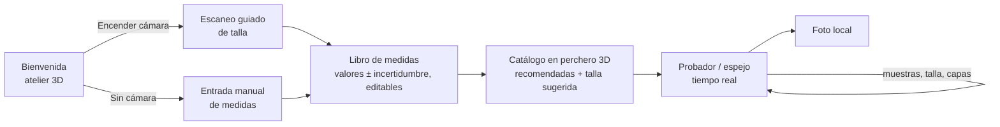
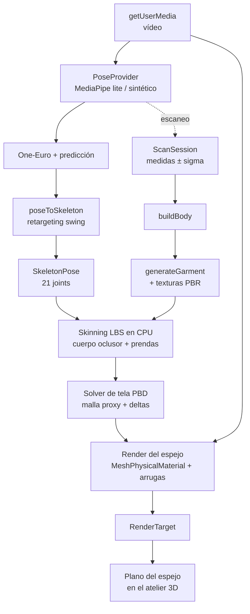

# Arquitectura

## Flujo de usuario

## Flujo de datos en tiempo real (todo en el navegador)

## Paquetes

| Paquete             | Responsabilidad                                                                                     | Puro (sin DOM/three) |
| ------------------- | --------------------------------------------------------------------------------------------------- | -------------------- |
| `@fitroom/shared`   | contratos: medidas (zod), esqueleto 21 joints, FK/skinning CPU, mallas, catálogo, tallaje, pose     | sí                   |
| `@fitroom/body`     | cuerpo paramétrico skinneado desde medidas, completado antropométrico, colisionadores               | sí                   |
| `@fitroom/pose`     | MediaPipe (adaptador), suavizado, retargeting, proveedor sintético, escaneo y estimación de medidas | lógica sí            |
| `@fitroom/garments` | `geometry/` prendas densas ajustadas · `fabric/` texturas PBR · `cloth/` solver PBD                 | sí                   |
| `@fitroom/catalog`  | telas, prendas, muestras, tablas de tallas, recomendación y outfits                                 | sí                   |
| `@fitroom/web`      | app Vite/React/R3F: mundo 3D, UI accesible, cámara, espejo, runtime                                 | no                   |
| `@fitroom/infra`    | AWS CDK: S3 + CloudFront + WAF, cabeceras de seguridad                                              | —                    |

Decisiones: ver [`docs/adr/`](adr). Convenciones y calidad: [`ENGINEERING.md`](ENGINEERING.md). Pruebas: [`testing-strategy.md`](testing-strategy.md).
